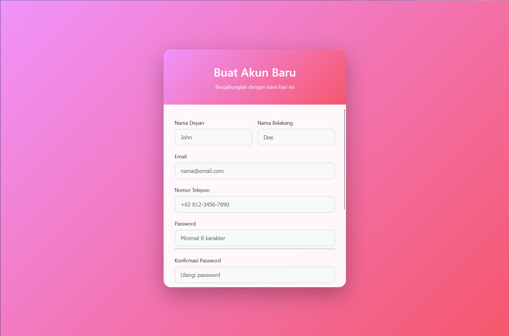

# 🔐 Login & Register Page UI

Proyek ini berisi tampilan **Halaman Login** dan **Halaman Register** yang dibuat dengan HTML, CSS, dan JavaScript.  
Desain clean dan modern dengan gradien warna lembut biar keliatan profesional tapi tetep aesthetic 😎

---

## 🖼️ Preview

### 💜 Halaman Login


### 💗 Halaman Register


---

## 🚀 Fitur
- Form login dengan validasi email & password  
- Form registrasi lengkap (nama, email, no HP, password)  
- Opsi login pakai **Google** atau **Facebook**  
- Desain **responsif** dan **modern**  
- Efek gradien lembut biar ga kaku 🩵

---

## 📂 Struktur Folder
```bash
project-login/
├─ register.html     # Halaman register  
├─ index.html        # Halaman login
├─ image/            # folder image
├─ README.md         # Dokumentasi (ini file)   